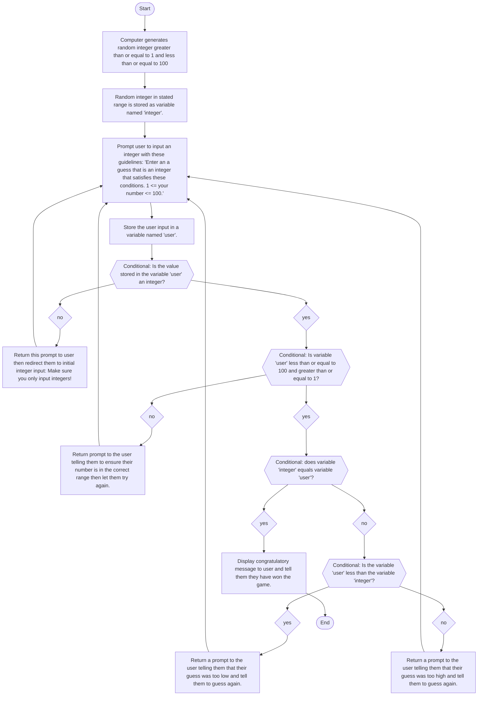

### Description
1. Upon starting the game, I had the computer generate a random integer in the range [1,100].
2. I stored the random integer created in a variable so I could access it late.
3. I let the user enter a random number within the range and provided specefic instructions.
4. I checked if the input provided by the user was an integer.
   * If it was, I allowed them to continue to the next step.
   * If not, I gave the user more instructions and let them try again by returning them to the previous input step.
5. I checked if the input provided by the user was in the correct integer range.
   * If it was, I allowed them to continue to the next step.
   * If not, I gave the user more instructions and let them try again by returning them to the input step.
6. Next, I compared the integer created by the computer with the one inputted by the user.
   * If the variables were equivalent, I ended the game and congragulated the user.
   * If they weren't, the game continued and it continues to the next comparison.
7. I provided a conditional to determine if the integer provided by the user was less than the one generated by the computer.
   * I created two outcomes for the conditional and told the user they were too high or too low depending on the outcome of the conditional.
8. The game continues until they guess the correct number and it ends at step 6.
